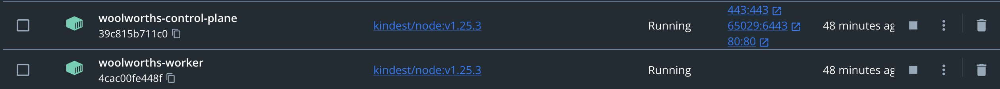

### Ingredients
- Docker
- Kind
- Helm
- Kustomize
- Terraform
- Ortelius
- Backstage

### Standardise Terraform Modular Structure

A Terraform module is simply a collection of `.tf` configuration files that define multiple related resources, coded in such a way that the code can be reused. The benefit of using modules is that coding effort will be greatly reduced when doing the same thing across multiple projects.

### Best practices for terraform modular structure

- `main.tf`, `variables.tf`, `outputs.tf`. These are the recommended filenames for a minimal module, even if they're empty. `main.tf` should be the primary entrypoint.
- The root directory of the project can be referred to as the `root module`. Nested modules, aka `child modules`, should exist under the `modules/` subdirectory. The code in the root module usually calls the child modules as required.
- These modules can be nested, although it is recommended not to go more than 3/4 levels deep and to avoid this if possible to reduce complexity.
- The root module and any nested modules should have `README` files.

A sample modular Terraform project structure looks like this:


Notice the multiple modules under `modules` directory. A recommended approach is to move this `modules` directory to a shared repository so all projects within your organization can call those centralized templatized reusable modules from their individual projects.

Also notice the `.tfvars` files located under the environment related directories such as `dev` and `prod` under `.env`.

These are the files holding environment specific values for the variables.

To continue our discussion above on templatized Lambda module, we now can have the root `main.tf` call the Lambda reusable module to create two new Lambda functions `lambda_demo1` and `lambda_demo2`, see snippet from our root `main.tf` below:

Notice we parameterized `role` here with a variable defined in root level's `variables.tf` file. We could parameterize the other variables as well, but for demo
purpose, let's just show one for now. The actual value of `lambda_iam_role_arn` is defined in `terraform.tfvars` file located under `.env/dev` folder.

```
bash
lambda_iam_role_arn = "arn:aws:iam::##########:role/service-role/lambda-test-role-#####"
```

A better approach would be to use Terraformer to import code for that IAM role, and modularize that `iam` module, then in root `main.tf`, create a new Lambda IAM role, then use the output of calling the `iam` module in the Lambda block, `role = module.iam.iam_role_arn`, instead of using hard-coded variable from `terraform.tfvars`. Well, readers are welcome to use this scenario as an exercise to practice on your own.

### [VSCode](https://code.visualstudio.com/) IDE
- Download `VSCode IDE` [here](https://code.visualstudio.com/download)
- Security starts in the IDE
- [Terms & Conditions](https://code.visualstudio.com/License/)

#### Helpful Extensions
- Install `Snyk Security | Code & Open Source Dependencies` scanner [here](https://marketplace.visualstudio.com/items?itemName=snyk-security.snyk-vulnerability-scanner)
- Install `Language Support for Java by Red Hat` [here](https://marketplace.visualstudio.com/items?itemName=redhat.java)
- Install `Yaml` support [here](https://marketplace.visualstudio.com/items?itemName=redhat.java)
- Install `Indent Rainbow` [here](https://marketplace.visualstudio.com/items?itemName=redhat.java)
- Install `Change All End of Line Sequence` [here](https://marketplace.visualstudio.com/items?itemName=vs-publisher-1448185.keyoti-changeallendoflinesequence)
- Install `ToDo Tree` [here](https://marketplace.visualstudio.com/items?itemName=Gruntfuggly.todo-tree)

### [Docker.com](https://www.docker.com/)
- [Account setup](https://hub.docker.com/signup)
- [Install](https://docs.docker.com/get-docker/)
- Get familiar with the basic commands
- Use [Devdocs](https://devdocs.io/) and the Docker documentation [here](https://docs.docker.com/)
- [Terms & Conditions](https://www.docker.com/legal/docker-terms-service/)

**Docker Security**
- Bake security right in from the word go
- We are going to use Snyk to scan our containers
- Snyk is free and you can set yourself up [here](https://snyk.io/)
- [Terms & Conditions for Snyk](https://snyk.io/policies/terms-of-service/)
- In `Docker Desktop` go to the ` Extensions Marketplace` and install the `Snyk Container Extension`
- On your command line you can now scan your Docker images with `docker scan your-docker-image`
- Disclaimer: Please follow any prompts `Snyk` requires you to fulfill to get up and running

#### .docker/config.json
```
{
	"auths": {
		"<account number>.dkr.ecr.eu-central-1.amazonaws.com": {},
		"https://index.docker.io/v1/": {}
	},
	"credsStore": "desktop",
	"currentContext": "desktop-linux"
}
```

#### List images
```
docker image list
```
#### Pull images to local
```
docker pull quay.io/ortelius/ortelius:latest
```
#### Copy
```
docker cp ~/.docker/config.json woolworths-control-plane:/var/lib/kubelet/config.json
```
#### Exec
```
docker exec -it woolworths-worker bash
```
#### Delete images
```
docker image rm quay.io/ortelius/ortelius
```
#### Octant the GUI perspective of K8s for developers
- Download [here](https://octant.dev/)

#### Kubeshark the API traffic viewer for K8s
- Download [here](https://github.com/kubeshark/kubeshark)

#### [Kind.sigs.k8s.io](https://kind.sigs.k8s.io/)
- Install [here](https://kind.sigs.k8s.io/docs/user/quick-start/#installation)
- Kind node releases [here](https://github.com/kubernetes-sigs/kind/releases)
- Kind allows you to use Docker to run K8s nodes as containers
- Get familiar with the basic commands
- Checkout the Kind documentation [here](https://kind.sigs.k8s.io/docs/user/quick-start/)
- [Terms & Conditions](https://www.apache.org/licenses/LICENSE-2.0)

#### Why kind?
- kind supports multi-node (including HA) clusters
- kind supports building Kubernetes release builds from source
- support for make / bash or docker, in addition to pre-published builds
- kind supports Linux, macOS and Windows
- kind is a `CNCF certified conformant Kubernetes installer`

#### Get the list of nodes
```
kind get nodes -n woolworths
```
#### Cluster info
```
kubectl cluster-info --context woolworths
```
#### Logs
```
kind export logs -n woolworths
```
#### Load images onto the container nodes
```
kind load docker-image --name woolworths --nodes woolworths-control-plane,woolworths-worker quay.io/ortelius/ortelius
```

### Helm
- Install Helm [here](https://helm.sh/)
- Also known as the package manager for Kubernetes
#### Helm Dashboard
- GitHub page [here](https://github.com/komodorio/helm-dashboard)
- Binds to all IPs `0.0.0.0:8080`
#### Install
```
helm plugin install https://github.com/komodorio/helm-dashboard.git
```
#### Update
```
helm plugin update dashboard
```
#### Uninstall
```
helm plugin uninstall dashboard
```
#### Add a Helm package
```
helm repo add argo https://argoproj.github.io/argo-helm
```
#### List Helm repos
```
helm repo list
```
#### Update Helm repos
```
helm repo update
```
#### Lint
```
helm lint ./helm-appsofapps
```
#### Debug
```
helm template ./helm-appsofapps --debug
```
#### Dry-run
```
helm install argocd ./helm-appsofapps --dry-run
```
#### Dry-run with Debug
```
helm install argocd ./helm-appsofapps --dry-run --debug
```

### [Terraform](https://www.terraform.io/intro)
- Install Terraform [here](https://www.terraform.io/downloads)
- Documentation is [here](https://www.terraform.io/docs)
- [Terms & Conditions](https://registry.terraform.io/terms)
#### Steps to get going
- Clone `ww-mvp` [here](https://github.com/vicvah/ww-mvp)
- Navigate to `ww-mvp/`
- Run the following

#### Deploy
```
terraform init
terraform plan
terraform apply -auto-approve
```

- You should see something like this in Docker Desktop


#### Tear down
```
terraform destroy
```

#### Logs
In total, there 5 log levels which can be used for debugging purposes:

- `TRACE` one of the most descriptive log levels, if you set the log level to *TRACE,* Terraform will write every action and step into the log file.
- `DEBUG` a little bit more sophisticated logging which is used by developers at critical or more complex pieces of code to reduce debugging time.
- `INFO` the info log level is useful when needing to log some informative instructions or readme type instructions.
- `WARN` used when something is not critical but would be nice to include in the form of a log so that the developer can make adjustments later.
- `ERROR` as the name suggests, this is used if something is terribly wrong and is a blocker.
```
export TF_LOG="DEBUG"
```
```
export TF_LOG_PATH="/abraham/terraform-debug.log"
```
